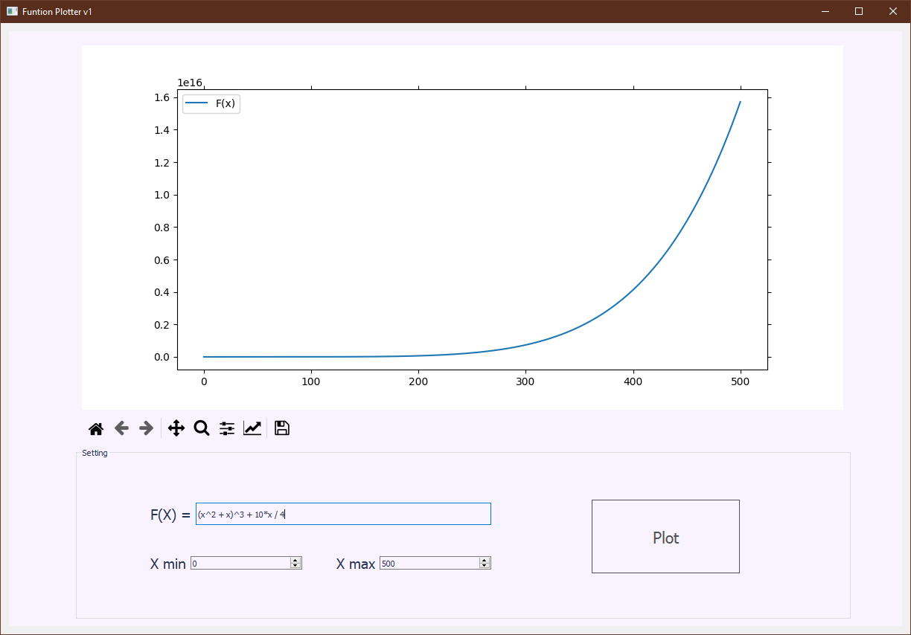
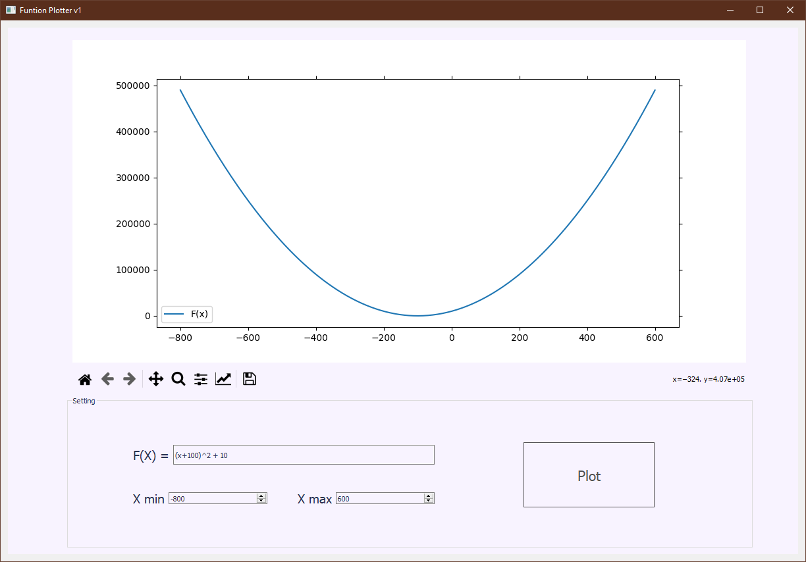
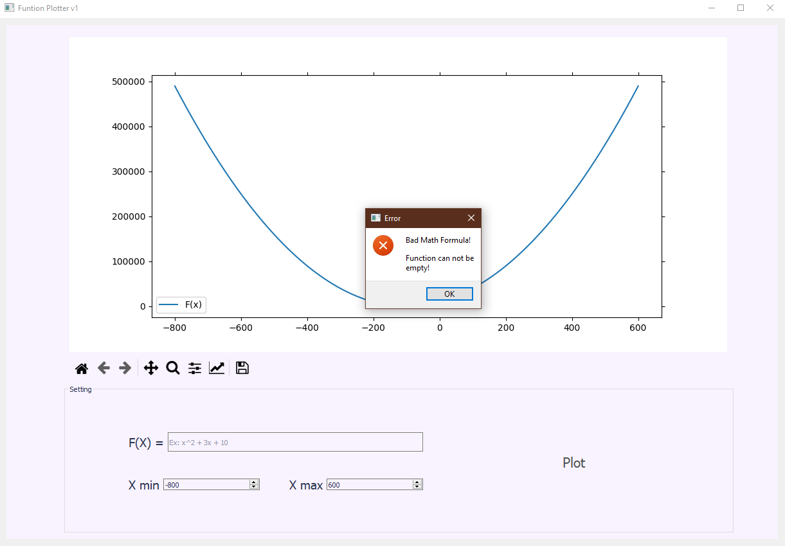
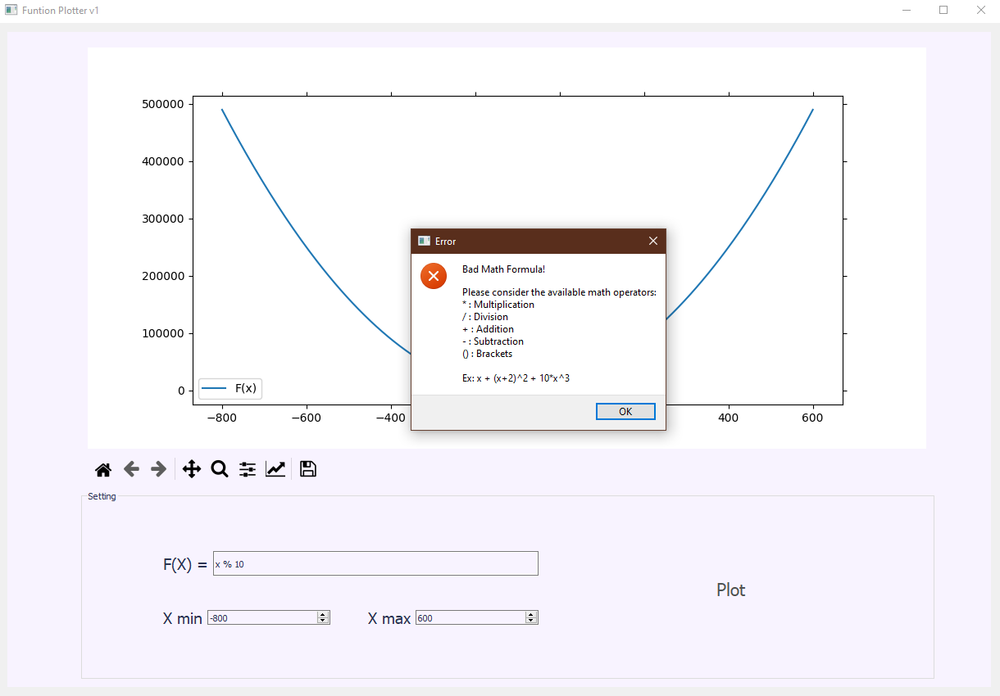

# FunctionPlotter# Function Plotter
Python GUI program that plots arbitrary user-entered function.

## Available mathematical operators

| Symbol | Function |
| ------ | ------ |
| * | Multiplication |
| / | Division |
| + | Addition |
| - | Subtraction |
| ^ | Power |
| () | Brackets |

## Tech

Dillinger uses a number of open source projects to work properly:

- [PySide2](https://pypi.org/project/PySide2/) - the official Python module from the Qt for Python project, which provides access to the complete Qt 5.12+ framework.
- [Matplotlib](https://matplotlib.org/) - comprehensive library for creating static, animated, and interactive visualizations in Python.

## Usage

Function Plotter requires [Python3](https://www.python.org/downloads/) along with [PySide2](https://pypi.org/project/PySide2/) and [Matplotlib](https://matplotlib.org/) to run.
```sh
cd FunctionPlotter
python main.py
```

For production environments...

```sh
npm install --production
NODE_ENV=production node app
```

## Screenshots

* Working Examples




* Wrong Examples


